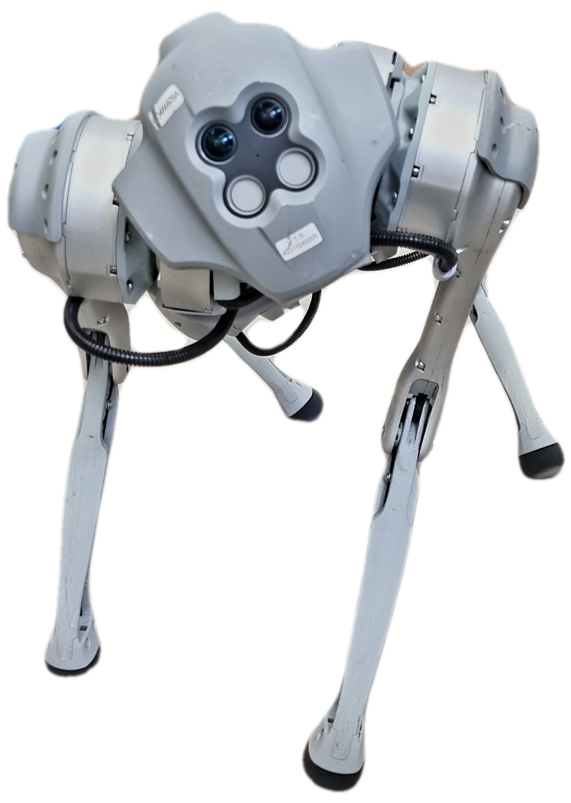

# Unitree Go1 ROS2 Driver


<p align="center">
    


## Description

This is a ROS2 package which can be used to control the legged robot **Unitree Go1**
using ROS topics.
With this driver, you can send commands to the robot via ROS topics such as `/cmd_vel` and receive robot sensor states such as `odometry` and `IMU` information.
In addition, this driver features some other cool functions, such as standing up the robot.
More of the features can be found [here](#features).
</p>

For more information about the different topics this ROS package subscribes to or publishes, please refer to the [ROS Topics](#ros-topics) section.


## Table of Contents

<!--toc:start-->

- [Installation](#installation)
  - [Dependencies](#dependencies)
- [Usage](#usage)
- [Features](#features)
  - [ROS Topics](#ros-topics)
    - [Subscribed Topics](#subscribed-topics)
    - [Published Topics](#published-topics)
  - [ROS Parameters](#ros-parameters)
  - [Robot LED statuses](#robot-led-statuses)
  - [Low Battery Protection](#low-battery-protection)
  - [Obstacle Avoidance](#obstacle-avoidance)
- [License](#license)
- [How to Contribute](#how-to-contribute)
- [Credits](#credits) - [Maintainers](#maintainers)
  - [Third-party Assets](#third-party-assets)
  <!--toc:end-->

## Installation

> _Before using this ROS2 package, you will need to make sure you have `ROS2 Foxy` installed on your machine.
> In case you want to use a ROS distro above the Foxy distribution, there is no
> guarantee that this package can run there.
> Nevertheless, plans to upgrade to a newer distro might be coming shortly._

To install and use this ROS2 package, you will need to clone it first, into a desired workspace.

```sh
mkdir -p ~/unitree_ws/src
cd ~/unitree_ws/src
git clone ---recurse-submodules https://github.com/snt-arg/unitree_ros.git
```

Once you have cloned this repository, you will need to build it using Colcon.

```sh
cd ~/unitree_ws
source /opt/ros/foxy/setup.bash # or zsh if using the zsh shell!
colcon build --symlink-install
source install/setup.bash # or zsh if using the zsh shell!
```

After having build the workspace, you should now be able to use the driver to control your robot.

### Dependencies

- [unitree_legged_sdk](https://github.com/unitreerobotics/unitree_legged_sdk): This is the SDK provided by the Unitree robotics. It is being used to send/receive all the High level commands to/from the robot.

- [unitree_ros_to_real](https://github.com/unitreerobotics/unitree_ros_to_real): This is a ROS1 package provided by the Unitree robotics. The ROS messages have been adapted for ROS2 support.

- **`faceLightSDK_nano`**: This is the SDK that can be found on the internal computers of the Unitree Go1. It has been ported to this ROS package with the goal of being able to control the face LEDs, which are used to
  give some robot statuses.

## Usage

Before using the driver, you will need to make a decision whether you want to control the robot
using a Wi-Fi connection or a wired connection. In case you go for a wired connection, you won't need
to do anything. In case you want to use the Wi-Fi connection, then you will need to change the IP address
of the robot. To do so, go to the config folder and open the `params.yaml` file. There, change the following line:

```yaml
robot_ip: '192.168.123.161' # Change to 192.168.12.1 for WIFI
```

to

```yaml
robot_ip: '192.168.12.1' # Change to 192.168.123.161 for wired
```

In addition, you might want to change some of the other parameters available, such as the topic names.

After having set the correct robot IP address, you are now able to run the driver. To do so, a launch file
is available, which makes it easier. Run the following commands to launch the driver.

```sh
source ~/unitree_ws/install/setup.bash # or zsh if using the zsh shell!
ros2 launch unitree_ros unitree_driver_launch.py
```

In case you do not want to use the launch file, just proceed with the following commands:

```sh
source ~/unitree_ws/install/setup.bash # or zsh if using the zsh shell!
ros2 run unitree_ros unitree_driver
```

## Features

### ROS Topics

#### Subscribed Topics

| Topic name    | Message Type                                                                                      | Description                                                                                             |
| ------------- | ------------------------------------------------------------------------------------------------- | ------------------------------------------------------------------------------------------------------- |
| `cmd_vel`     | [geometry_mgs/msg/Twist.msg](http://docs.ros.org/en/noetic/api/geometry_msgs/html/msg/Twist.html) | This is used by the driver to receive velocity commands and send the appropriate commands to the robot. |
| `/stand_up`   | [std_msgs/msg/Empty.msg](http://docs.ros.org/en/melodic/api/std_msgs/html/msg/Empty.html)         | Triggers the robot to stand up                                                                          |
| `/stand_down` | [std_msgs/msg/Empty.msg](http://docs.ros.org/en/melodic/api/std_msgs/html/msg/Empty.html)         | Triggers the robot to stand down                                                                        |

#### Published Topics

| Topic name | Message Type                                                                                   | Description                                                                  |
| ---------- | ---------------------------------------------------------------------------------------------- | ---------------------------------------------------------------------------- |
| `/odom`    | [nav_msgs/msg/Odometry.msg](http://docs.ros.org/en/noetic/api/nav_msgs/html/msg/Odometry.html) | The odometry state received from the robot is being published to this topic. |
| `/imu`     | [sensor_msgs/msg/IMU.msg](http://docs.ros.org/en/noetic/api/sensor_msgs/html/msg/Imu.html)     | The IMU state received from the robot is being published to this topic.      |
| `/bms`     | [unitree_ros/msg/bms.msg](https://github.com/snt-arg/unitree_ros/blob/main/msg/BmsState.msg)   | The battery state received from the robot is being published to this topic.  |

## ROS Parameters

| Parameter Name                | Default value   | Description                                                                                              |
| ----------------------------- | --------------- | -------------------------------------------------------------------------------------------------------- |
| `ns`                          | -               | Name space that should be given to robot driver                                                          |
| `robot_ip`                    | 192.168.123.161 | Robot IP that should be used to establish the UDP connection. For a Wi-Fi conntection use `192.168.12.1` |
| `robot_target_port`           | 8082            | The port that should be used to communicate with the robot.                                              |
| `cmd_vel_topic_name`          | /cmd_vel        | Topic name that should be used for subscribing to velocity commands                                      |
| `odom_topic_name`             | /odom           | Topic name that should be used for publishing the odometry state                                         |
| `imu_topic_name`              | /imu            | Topic name that should be used for publishing the IMU state                                              |
| `bms_state_topic_name`        | /bms_state      | Topic name that should be used for publishing the battery management state, such as battery level.       |
| `imu_frame_id`                | imu             | Frame id that should be used for the IMU frame                                                           |
| `odom_frame_id`               | odom            | Frame id that should be used for the odometry frame                                                      |
| `odom_child_frame_id`         | base_footprint  | Frame id of the body of the robot                                                                        |
| `use_obstacle_avoidance`      | false           | Enables (true) or disables (false) the robot obstacle avoidance.                                         |
| `low_batt_shutdown_threshold` | 20              | Battery threshold for when to stop the robot from moving, in case the battery is below                   |

### Robot LED statuses

The robot has a few predetermined LED statuses, which are useful to give some information to
anyone using the robot.
The following statuses are available:

- **Green Light**: Ready status

    
- **White Light**: Idle status

    
- **Blue Light**: Moving status

    
- **Yellow Light**: Low battery _(< 30 %)_

    
- **Red Light**: Any internal error (Not yet implemented)

### Low Battery Protection

By specifying a low battery threshold using the parameters file (`low_batt_shutdown_threshold`), the driver will stop the robot
from moving and will stand it down. _By default, the low battery threshold value is set to 20%._

### Obstacle Avoidance

The robot has an obstacle avoidance mode. However, this mode is not enabled by default. Therefore,
this driver allows you to enable it using the parameters file (`use_obstacle_avoidance`). _By default, this is
set to false_

## License

This project is licensed under the BSD-3 License - see the LICENSE file for details.

## How to Contribute

Contributions are welcome! If you have any suggestions, bug reports, or feature requests,
please create a new issue or pull request.

## Credits

#### Maintainers

- [Pedro Soares](https://www.github.com/PedroS235)

#### Third-party Assets

- [Unitree Robotics](https://github.com/unitreerobotics)
